<div align="center">



<br>

[](https://linkedin.com/in/amiiiirkamali)
[](mailto:amirrezakamali5382@gmail.com)
[](#)
[](#)

</div>

---

### `> whoami`

Computer Engineering graduate building **scalable backend systems** and **AI-powered agents**.
Day to day I design APIs and data models in **Python / Django / FastAPI**, wire them to **LLM pipelines**,
and ship them on **Docker + Linux**. I have delivered production systems for **banking**, **fintech**,
and the **Iranian Judiciary**, and I still enjoy dropping down to **VHDL on FPGA** when the problem calls for hardware.

- 🛠️ Currently backend + AI at **Mayatek**, and freelancing for clients including **Snapp** and **Blu Bank**
- 🧠 Focus areas: backend architecture, AI integration, intelligent agents, process automation
- 🎓 B.Sc. Computer Engineering — Quchan University of Technology, 2025
- 📫 **amirrezakamali5382@gmail.com** · [in/amiiiirkamali](https://linkedin.com/in/amiiiirkamali)

---

<div align="center">











</div>

---

### `> stack`


---

<details>
<summary><b>How this profile builds itself</b></summary>

<br>

Every panel above is an SVG rendered by [`scripts/generate.py`](scripts/generate.py) from
[`config.json`](config.json) plus live GitHub data, then committed by a scheduled GitHub Action.
No third-party stats services, no runtime JavaScript — just deterministic SVG.

```bash
python -m pip install -r scripts/requirements.txt
python scripts/generate.py --demo          # offline preview with sample data
python scripts/generate.py                 # live GitHub data
python scripts/generate.py --only missions # rebuild a single panel
```

| Asset | Panel | Data source |
| --- | --- | --- |
| `assets/identity.svg` | ASCII portrait + animated wordmark | `config.json` + `assets/profile-source.png` |
| `assets/signal.svg` | Stats cards + language stack | GitHub REST |
| `assets/contributions.svg` | Contribution calendar + streaks | GitHub GraphQL (HTML fallback) |
| `assets/arsenal.svg` | Grouped tech stack | `config.json` |
| `assets/trajectory.svg` | Career timeline | `config.json` |
| `assets/missions.svg` | Featured projects | `config.json` |

</details>

<div align="center">
<sub><code>aqua launch</code> · assets regenerated daily · built by Amirreza Kamali</sub>
</div>
